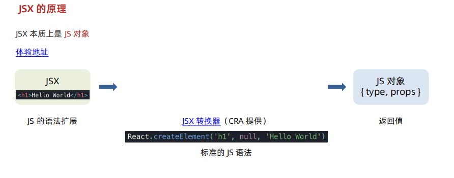

JSX 的使用和原理

- JSX 允许你在 JS 文件中写类似 HTML 的标记，是 JS 的语法扩展
  1. 作用：写 React 页面结构
  2. 原理：JSX 是 JS 的语法扩展

JSX 的使用

- 作用：写 React 页面结构，类似 HTML
- 规则：① 唯一根节点 ② 标签闭合 ③ 属性名称驼峰

如果有问题，直接按照提示进行修改就可以

JSX 本质是一个 JS 对象

Babel 这个网站中的 try it out 可以清楚看到其中的转换过程；
